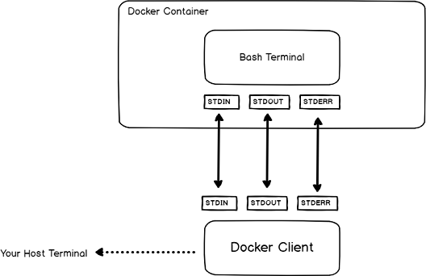

<h6>ver. Dec. 2022</h6>
<h2> Docker Container Management</h2>

1. Docker container installation: Kali-linux or Ubuntu on VirtualBox

    - Refer to [docker installation guide](https://docs.docker.com/get-docker/)

    ```sh
    # uninstall old versions
    sudo apt remove docker docker-engine docker.io

    # install docker community edition: Ubuntu
    sudo apt install docker.io -y
    sudo docker images

    ```

2. Docker commands
    - sudo docker pull
    - sudo docker run
    - sudo docker start
    - sudo docker stop
    - sudo docker ps
    - sudo docker exec -it
    - sudo docker logs
3. Docker container vs. IMAGE
    - Container is a virtual system which is running environment for an IMAGE
    - Container is port bounded to talk to applicatiohn running inside of container
    - Application image: postres, redis, mongo, etc.
    - Images can be pulled from [docker hub](https://hub.docker.com/)

---

```sh

## docker commands
# sudo docker pull
# sudo docker run
# sudo docker start
# sudo docker stop
# sudo docker ps
# sudo docker exec -it
# sudo docker logs

## pull image
sudo docker pull redis
sudo docker images

## docker run = docker pull + docker start
sudo docker run redis:4.0

## docker run
sudo docker run redis   # ^C to stop a container
sudo docker ps

# run on detached mode
sudo docker run -d redis
sudo docker ps

# restart of a container
sudo docker stop container-id
sudo docker ps
sudo docker start container-id
sudo docker ps

# display history of all containers: list of running and stopped containers
sudo docker ps -a

# bind host and container ports:
# - multiple containers run on a host machine
# - host machine has only ceratin number of ports available
# - confilict occur when same port on host machine is assigned
# - bind a host port number and container port number: "host-port#:container-port#"
sudo docker run -d -p6001:6379 redis:4.0
sudo docker run -d -p6000:6379 redis
sudo docker ps

# debugging containers
sudo docker ps
sudo docker logs container-id # or
sudo docker logs container-name

# specify container name
sudo docker run -d -p6001:6379 --name redis-old redis:4.0
sudo docker run -d -p6000:6379 --name redis-latest redis
sudo docker ps

# execute interactive commands in a container: only limited commands can be used (a light-weight OS installed)
sudo docker exec -it redis-old /bin/bash
> ls
> cd /
> ls
> pwd
> env
> exit
sudo docker ps


## list docker images
sudo docker images # or
sudo docker image ls

# filter installed docker images on reference, before, since, label, dangling,
# sudo docker images --filter "<key>=<value>"
sudo docker images --filter "dangling=true"
sudo docker images --filter "before=debian:8"
sudo docker images --filter "since=ubuntu"

# listing and formatting docker images on .ID, .Repository, .Tag, .Size, .CreatedSince, .Digest
sudo docker images --format "{{.Repository}} has the following {{.ID}}"
sudo docker images --quiet

## Docker Exec command
# sudo docker exec <options> <container> <command>
sudo docker ps
sudo docker exec 4859xxxxxxxx ls

# interactive operation: -it
sudo docker exec -it juice-shop ls
sudo docker exec -it juice-shop sh
> ls
> exit
```



```sh
# docker exec as root: "-u 0"
sudo docker exec -u 0 juice-shop whoami
# docker exec multiple commands: sudop docker exec <bontainer> bash -c "command1 ; command2 ; command3"
sudo docker exec juice-shop sh -c "ls ; cat server.js"
# docker exec in a specific directory"
sudo docker exec -w /juice-shop/logs juice-shop cat access.log.2022-12-20
# nothing logged yet

## docker run vs. docker exec
# docker run: creates a temporary container and execute the command
docker run -it ubuntu:18.4 sh
> exit
# docker exec: executes a command on a running container
docker exec -it juice-shop sh
> exit

```

```sh
## docker logs
# docker daemon logs:   debian distributions - /var/log/daemon.log
#                       windows OS - AppData/Local

# inspect docker daemon logs
tail -f -n 100 /bar/log/daemon.log | grep --color docker
sudo journalctl -u docker.service | less
# use the log option
sudo docker logs juice-shop
sudo docker logs --since 10h juice-shop
sudo docker logs --since 2022-10-10T10:00:00 juice-shop
sudo docker logs --until 10h juice-shop
sudo docker logs --since 2022-12-20T11:00:00 juice-shop

```
